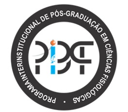
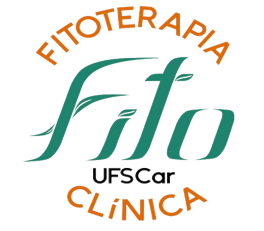

# PlenaPausa
## Projeto da Tese de Doutorado da professora Rita Cotta

Este site foi criado com carinho e dedicação pela equipe de pesquisa que investiga o uso do LASER e fitoterapia no manejo dos sintomas da menopausa, do Programa Interinstitucional de Pós-Graduação em Ciências Fisiológicas da Universidade Federal de São Carlos e UNESP, com apoio do Grupo de Pesquisa de Engenharia e Ciências da Computação do Centro Universitário do Estado do Pará (CESUPA), para compartilhar Informações sobre a menopausa com conteúdo educativo sobre saúde da mulher, bem-estar e qualidade de vida.  
  
### Autores:
**Ma. Rita Cristina Cotta Alcântara**  
Doutoranda no Programa Interinstitucional de Pós-graduação em Ciências Fisiológicas UFSCar/UNESP (PIPGCF)  
**Prof. Dr. Gerson Jhonatan Rodrigues**  
Departamento de Ciências Fisiológicas Universidade Federal de São Carlos (UFSCar),
Programa Interinstitucional em Ciências Fisiológicas UFSCar/UNESP 

    

O desenvolvimento do site foi feito pelo Grupo de Estudo em Tecnologia Assistiva (GETA) do CESUPA.  
Coordenadora responsável: **Profa. Ma. Alessandra Natasha Alcantara Barreiros Baganha**  
Responsável pelo projeto: **Me. Matheus Henrique Almeida dos Santos**  
Alunos envolvidos: **Bernardo Gomes Brandão, Gabriel Gonçalves da Silva**

> [!TIP]
> Encontre-nos em [geta.omnicesupa.com](https://geta.omnicesupa.com/)